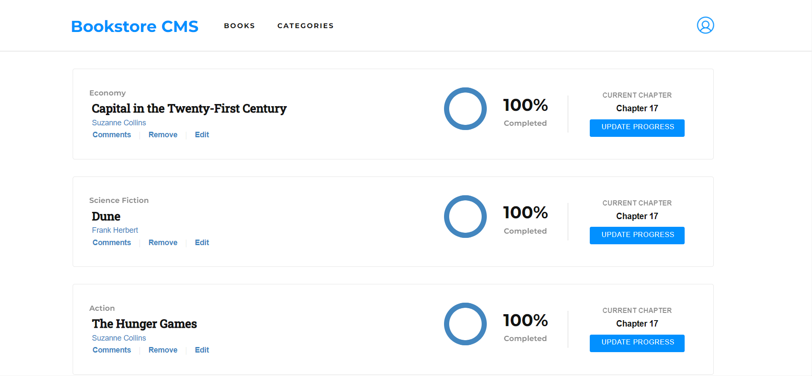

# Book Store

This project was developed to add, remove and show your booklist !.



## Built with

- React
- Linters
- Redux
- VS code

## Live Website

[Book store](https://bookstore1223.herokuapp.com/)

## Usage

start by cloning this repository by running:

git clone https://github.com/abdulrahmanshr75/Book-Store-React.js.git

cd into the folder

install all the packages needed by this command :

```
npm install
```

you can run this website on live server by this command :

```
npm run start
```

to build the project run :

```
npm run build
```

## Author

👤 Abdulrahman Shrshar

- [Github Account](https://github.com/abdulrahmanshr75)
- [Linkedin Account](https://www.linkedin.com/in/abdulrahman-shrshar-721144161/)

## Show your support

Give a ⭐️ if you like this project!
